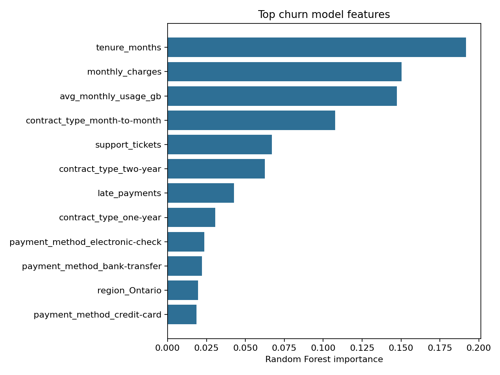
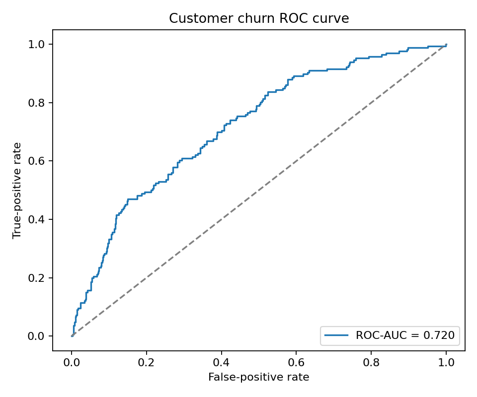

# Customer Churn Analytics

> End-to-end customer-retention analytics with SQL, reproducible feature engineering, model validation, and business-facing recommendations.

## Business question

Which customer behaviors are associated with churn, and how can a retention team identify high-risk customers without relying on accuracy alone?

This portfolio project generates a realistic synthetic subscription dataset, analyzes churn patterns with SQL, and trains a validated classification pipeline. Synthetic data keeps the repository fully shareable while preserving the structure of a practical business problem.

## What this project demonstrates

- Reproducible data generation and clear data documentation
- SQL-based customer segmentation
- Mixed numeric and categorical preprocessing
- Stratified train/test splitting and five-fold cross-validation
- Evaluation with ROC-AUC, precision, recall, F1, and a confusion matrix
- Interpretable feature importance and actionable retention recommendations
- Lightweight unit tests for the data and modeling pipeline

## Repository structure

```text
customer-churn-analytics/
├── data/                  # Generated synthetic customer data
├── results/               # Metrics, SQL summaries, and figures
├── sql/analysis.sql       # Recruiter-readable SQL analysis
├── src/
│   ├── generate_data.py
│   ├── run_sql_analysis.py
│   ├── train.py
│   └── run_pipeline.py
├── tests/
├── requirements.txt
└── README.md
```

## Quick start

```bash
python -m venv .venv
python -m pip install -r requirements.txt
python src/run_pipeline.py
python -m unittest discover -s tests -v
```

On Windows PowerShell, activate the environment with `.venv\Scripts\Activate.ps1` before installing requirements.

## Outputs

Running the pipeline creates:

- `data/customer_churn.csv`
- `results/metrics.json`
- `results/sql_summary.csv`
- `results/feature_importance.csv`
- `results/confusion_matrix.png`
- `results/roc_curve.png`
- `results/feature_importance.png`

## Results

Using a held-out test set of 750 customers, the pipeline achieved:

| Metric | Score |
|---|---:|
| ROC-AUC | 0.720 |
| Accuracy | 0.763 |
| Precision | 0.464 |
| Recall | 0.470 |
| F1 | 0.467 |
| Five-fold CV ROC-AUC | 0.708 +/- 0.042 |

The moderate results are intentional: churn is probabilistic, and the generated target includes irreducible uncertainty rather than a perfectly separable rule. The feature analysis highlights tenure, charges, contract structure, service usage, support demand, and late payments as useful retention signals.





## How to discuss it in an interview

The central modeling choice is to evaluate ranking quality and minority-class performance, not just overall accuracy. Churn programs often care about recall because a false negative is a customer the organization never attempts to retain. The threshold should ultimately be selected using campaign capacity and the relative cost of outreach versus customer loss.

## Responsible-use note

All customers in this repository are synthetic. The model is an educational demonstration and should not be used for real customer decisions without data-quality assessment, fairness review, threshold calibration, and production monitoring.

## Research connection

This is an independent portfolio project designed to demonstrate broad data-science skills. It is not code from, or a reproduction of, any academic paper.
